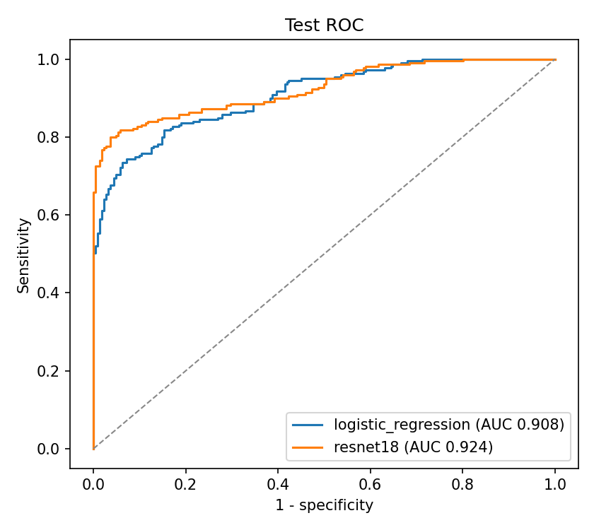
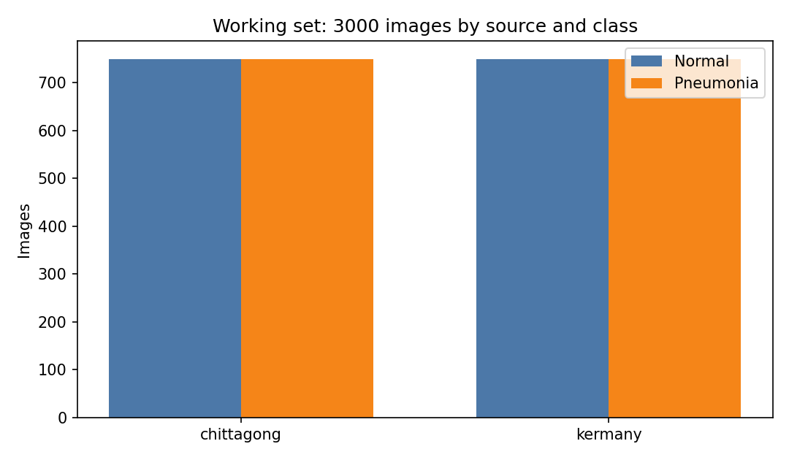
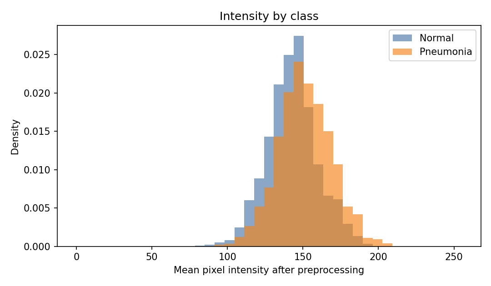
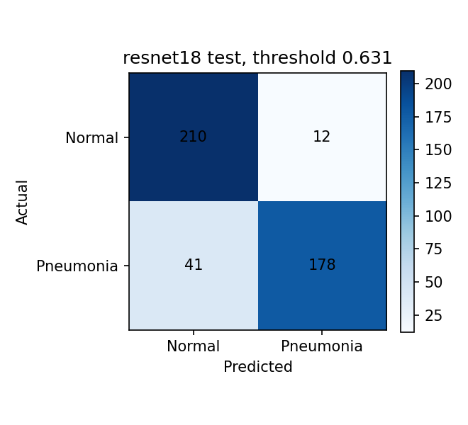
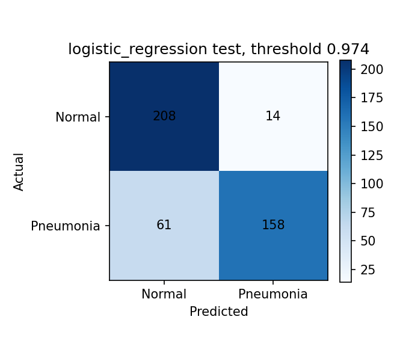
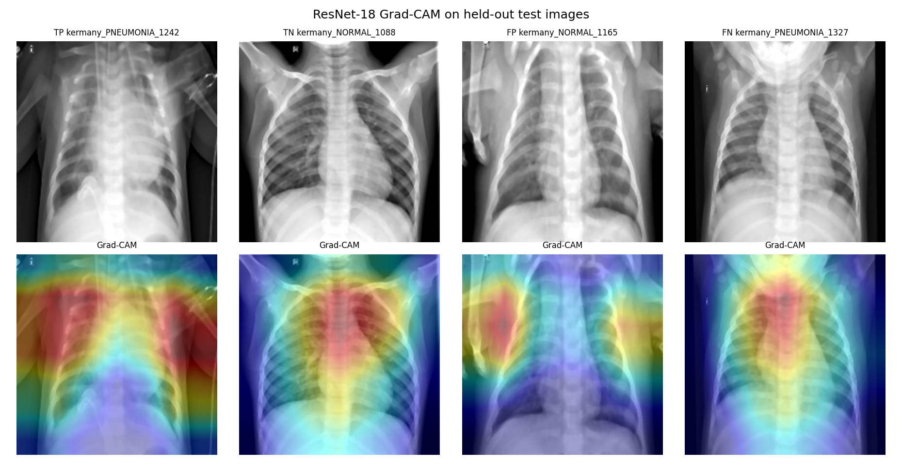

# Chest X-ray pneumonia classifier

**TL;DR:** Logistic regression on handcrafted features vs a fine-tuned ResNet-18 on a de-duplicated, class-balanced 3,000-image chest X-ray set. Test ROC AUC 0.908 vs 0.924. The paired bootstrap CI for the difference includes zero. This is a research comparison, not a diagnostic device.



## Abstract

I assembled a 3,000-image chest X-ray working set from two CC BY 4.0 Mendeley datasets, removed duplicate files, and kept the pneumonia and normal classes equal. A logistic regression on handcrafted features reached a held-out ROC AUC of 0.908, and a fine-tuned ResNet-18 reached 0.924. A paired bootstrap interval for that 0.016 difference included zero. The project is a reproducible comparison of a classical baseline and a convolutional network, including preprocessing, a statistical check on the images, and Grad-CAM. It is not a diagnostic device.

## Clinical background

Chest radiography is a common first test when pneumonia is suspected. Reading films is variable across clinicians and settings, so automated classification has been studied as a way to triage or to second-read images. Public pediatric collections, especially the Guangzhou chest X-ray set released by Kermany and colleagues, have produced very high published accuracies. Those numbers are easy to over-read: the images come from a narrow population, the original labels pool bacterial and viral pneumonia, and a random image split can put two films of the same child on both sides of the evaluation.

This repository asks a narrower question. After two public archives are merged, de-duplicated, and balanced, how does a logistic regression on fixed features compare with a fine-tuned ResNet-18 on a patient-aware holdout, and what do the errors look like?

## Methods

### Data sources and licenses

Both archives are public Mendeley Data records. No new images were collected.

| Source | What was used | License | Citation |
| --- | --- | --- | --- |
| Kermany, Zhang, and Goldbaum, Mendeley Data V2, [doi:10.17632/rscbjbr9sj.2](https://doi.org/10.17632/rscbjbr9sj.2) | `ChestXRay2017.zip` only. The OCT archive in the same record was not downloaded. | CC BY 4.0 | Kermany D, Zhang K, Goldbaum M (2018). Labeled Optical Coherence Tomography (OCT) and Chest X-Ray Images for Classification. Mendeley Data, V2. |
| Hira and colleagues, Mendeley Data V4, [doi:10.17632/wndbd5r26y.4](https://doi.org/10.17632/wndbd5r26y.4) | The version-4 zip of chest radiographs from Epic Hospital, Chittagong. A later version 5 exists; version 4 is pinned so the file hash stays fixed. | CC BY 4.0 | Hira MDIK, Bithee MMA, Ahmed S, Akter L, Anonna MJM (2026). A Primary Chest X-ray Dataset of Normal and Pneumonia Cases from Epic Chittagong, Bangladesh. Mendeley Data, V4. |

The related clinical paper for the first archive is Kermany et al., *Cell* 2018;172(5):1122–1131. SHA-256 of the downloaded zips:

- `ChestXRay2017.zip` (1,235,512,464 bytes): `13efc055629733dbab07877f8b3c9f81097840dbcdaa326a8542322c2281ce36`
- `epic_chittagong_v4.zip` (524,752,385 bytes): `a4b400d3b04454976f67ab2686e60bd74e4149cd5e6cc05af7102c62cc0132b7`

Raw folder counts, before de-duplication:

| Source | Normal | Pneumonia |
| --- | ---: | ---: |
| Kermany | 1,583 | 4,273 |
| Chittagong | 1,320 | 1,306 |

The Chittagong text description says 3,355 images. The version-4 zip contains 2,626 image files. Counts below are from those files.

### Working set

`src/data/prepare.py` keeps Kermany copies when an exact SHA-256 matches, then drops a later file whose 16×16 area-downsampled grayscale bytes match an earlier file. That removed 638 images (159 exact file hashes and 479 identical 16×16 signatures). Most of the dropped Chittagong pneumonia files matched a Kermany image, so the two archives are not independent collections.

From the remaining pool the script draws exactly 3,000 images with seed 42: 1,500 normal and 1,500 pneumonia, with 750 images from each source in each class. The larger class is 1.0 times the smaller class, inside the 1.5 limit set in `configs/default.yaml`.

Splits are 70/15/15 by patient group, seed 42. Kermany pneumonia filenames contribute a `person` id, and Kermany normal filenames contribute an `IM-` id. Chittagong filenames do not publish a patient id, so each of those files is its own group. Actual image counts:

| Split | Normal | Pneumonia | Images | Share |
| --- | ---: | ---: | ---: | ---: |
| Train | 1,053 | 1,052 | 2,105 | 70.2% |
| Validation | 225 | 229 | 454 | 15.1% |
| Test | 222 | 219 | 441 | 14.7% |

The manifest is `reports/manifest.csv`. The test set is used once, after thresholds are chosen on validation.

### Preprocessing

Every selected radiograph is converted to grayscale, resampled to 224×224, denoised with a 3×3 median filter, and intensity-normalized by stretching the 1st–99th percentile window onto 0–255. "Alignment" here means that common canvas. The archives do not include landmarks for spatial registration.

The median filter is a separate C++ program, `cpp/median_denoise.cpp`, compiled with g++ and called through `subprocess` on binary PGM files. A NumPy implementation of the same replicate-border filter is the reference. On 100 images the maximum absolute pixel difference was 0.

| Implementation | 100 images of 224×224 | Throughput |
| --- | ---: | ---: |
| C++ executable, including process start and PGM read/write | 1.017 s | 98 images/s |
| In-memory NumPy median | 0.293 s | 341 images/s |

The full 3,000-image denoise used by training took 29.4 s in the C++ program. The NumPy reference is faster on this machine: it is vectorized, and its timer does not include process startup or file I/O. The C++ binary is a scalar 32-bit build (`g++ 15.2.0`, i686 MinGW). The pipeline still runs that executable so the comparison is the one the training images actually went through.

Training augmentation, applied only to the training split, is a horizontal flip (probability 0.5), a rotation of ±15 degrees, and a contrast scale drawn from 0.8–1.2. A horizontal flip moves the heart to the right side of the image, so flipped films are not anatomically realistic; see Limitations.

### Models

The baseline is a logistic regression (`C = 1`, `class_weight = balanced`, seed 42) on 1,863 standardized features: HOG on a 128×128 view, a 32-bin intensity histogram, mean, standard deviation, skewness, and an 8×8 average pool. No threshold is tuned on the test set.

The convolutional model is an ImageNet ResNet-18 with a new two-class head, trained in PyTorch. The backbone learning rate is `1e-5` and the head learning rate is `1e-4` (AdamW, weight decay `1e-4`, batch size 16). The checkpoint is the epoch with the highest validation AUC, with patience 2 and a maximum of 6 epochs. This run used the CPU wheel of PyTorch 2.10. Early stopping kept epoch 2 (validation AUC 0.950) after epoch 4. Each epoch took about 114–118 seconds.

### Evaluation

Pneumonia is the positive class. The reported operating point maximizes Youden's J on the validation probabilities and is then frozen for the test set. ROC AUC does not use that threshold. A second column uses probability 0.5 so the logistic regression is not judged only at its high Youden cutoff (0.974). That cutoff is unusually high, which suggests the logistic regression's probabilities are not well calibrated; no calibration step was applied to either model. Uncertainty on the AUC is a 2,000-draw percentile bootstrap.

Grad-CAM is taken from the last residual block of ResNet-18 and is drawn for the predicted class on one true positive, true negative, false positive, and false negative.

## Results



The pneumonia proportion in the working set is 0.500. The 95% Wilson interval is 0.482–0.518. A chi-square test against a 50/50 design has statistic 0 and p = 1, which only restates the sampling rule.

Mean pixel intensity after preprocessing is higher for pneumonia (151.4, SD 17.8) than for normal films (143.1, SD 16.8). The Welch difference (pneumonia minus normal) is 8.28 gray levels, 95% CI 7.05–9.52, t = 13.11 on 2,986 degrees of freedom, p = 3.1×10⁻³⁸. A two-sided Mann–Whitney test gives p = 1.8×10⁻³⁷. This comparison uses all 3,000 images, including the test split; nothing in the models or thresholds was chosen from it. That shift can come from disease, from acquisition, or from the percentile stretch. It is not by itself evidence of a clinical marker.



Test ROC, 441 images (figure at the top of this page):

| Model | AUC | 95% bootstrap CI |
| --- | ---: | --- |
| Logistic regression | 0.908 | 0.880–0.934 |
| ResNet-18 | 0.924 | 0.898–0.948 |

ResNet-18 minus logistic regression is +0.016, paired 95% bootstrap CI −0.003 to +0.037. The interval includes zero, so this test set does not separate the two models cleanly.

Operating point chosen on validation (Youden), then applied to the test set:

| Model | Threshold | Sensitivity | Specificity | Accuracy |
| --- | ---: | ---: | ---: | ---: |
| Logistic regression | 0.974 | 0.721 | 0.937 | 0.830 |
| ResNet-18 | 0.631 | 0.813 | 0.946 | 0.880 |

The same test probabilities at a fixed threshold of 0.5:

| Model | Sensitivity | Specificity | Accuracy |
| --- | ---: | ---: | ---: |
| Logistic regression | 0.822 | 0.829 | 0.825 |
| ResNet-18 | 0.822 | 0.905 | 0.864 |

At 0.5 the two models have the same sensitivity (180/219 pneumonia images). ResNet-18 makes fewer false positive calls (21 versus 38).







On the true positive, the map sits over a lung field. On the true negative it concentrates on the mediastinum. The false positive and false negative do not show a single focal consolidation that would explain the decision. Grad-CAM here is a sanity check, not a radiology report.

## Limitations and ethics

This model must not be used to diagnose, rule out, or triage patients. It has not been tested prospectively, it has no calibration for a real clinic's prevalence, and a positive predictive value computed on a 50/50 sample would not transfer to practice.

The Kermany radiographs are a pediatric cohort from Guangzhou. The Chittagong archive does not include age or sex in the files used here. Several Grad-CAM examples also look pediatric. Performance on adult films, portable ICU films, or other hospitals is unknown. Bacterial and viral pneumonia are one positive label, so the model is not a pathogen classifier.

De-duplication showed substantial overlap: hundreds of Chittagong pneumonia files were identical, at a 16×16 downsample, to images already in the Kermany archive. After that filter the working set still contains 750 pneumonia images from each source folder, but the Chittagong pneumonia half is the non-overlapping remainder (768 available before sampling). Treating the two downloads as two independent populations would overstate the evidence. The filter only removes exact matches at 16×16; near-duplicates such as re-crops or re-exposed copies of the same film can survive and cross splits.

The class ratio was forced to 1:1. Sensitivity and specificity are therefore not the values one would see at the prevalence of an emergency department. The chi-square result above is a check of that design, not a finding that pneumonia and normal films are equally common.

Patient grouping is incomplete. Where Kermany filenames encode a person id, both images stay in one split. Chittagong names look like per-image ids. If one person contributed several files, those files can fall into train and test. That would make the test AUC optimistic, as would any surviving near-duplicates. The original Kermany validation folder has only a handful of images, so this project pools the official folders and re-splits them. That choice is documented in `reports/prepare_summary.json`; it does not create a new external site.

Horizontal-flip augmentation produces mirror-image chests (heart on the right). It was kept as a generic regularizer, but it is not anatomically realistic and a version without it has not been compared.

No radiologist re-read these labels for this project. Label noise, markers burned into the film, and pediatric body shape can all be shortcuts. The mediastinal Grad-CAM on a true negative is a reminder that a high AUC can come from cues other than consolidation. There is no fairness audit by age, sex, scanner, or hospital, because those fields are not in the manifest.

The intensity difference between classes should not be quoted as a biological result without a pre-registered acquisition protocol. Percentile normalization can itself change the mean.

Both datasets are CC BY 4.0. Redistribution of derived figures in this repository keeps that attribution. The images remain someone else's clinical data even though they are public: they are not a reason to collect new identifiable films, and they are not a product.

## Reproducing the project

Verified with Python 3.13, the CPU wheels `torch==2.10.0+cpu` and `torchvision==0.25.0+cpu`, and the packages in `requirements.txt`. A CUDA build of PyTorch works with the same scripts when `torch.cuda.is_available()` is true. This recorded run did not use the GPU. g++ with C++17 is required for the median-filter executable; `src/preprocessing/preprocess.py` compiles `cpp/median_denoise.cpp` if the binary is missing.

From the repository root:

```bash
pip install -r requirements.txt
python -m src.data.download
python -m src.data.prepare
python -m src.preprocessing.preprocess
python -m src.eda.explore
python -m src.models.baseline
python -m src.models.train_cnn
python -m src.evaluation.evaluate
```

`python scripts/run_pipeline.py` runs those steps in order. The random seed is 42 in `configs/default.yaml`. Download needs network access to Mendeley Data and about 2 GB for the two zips. Expect roughly two minutes per ResNet epoch on a recent laptop CPU.

Unit checks that do not need the radiographs:

```bash
python -m unittest tests.test_sample tests.test_preprocess tests.test_metrics
```

## Repository layout

```text
configs/default.yaml          seed, sample size, training hyperparameters
src/data/                     download, de-duplication, 3000-image sample, splits
src/preprocessing/            resize, percentile normalization, C++ launch
cpp/median_denoise.cpp        3x3 median filter
src/eda/explore.py            class counts, Wilson interval, Welch test
src/models/                   logistic regression and ResNet-18
src/evaluation/               ROC, confusion matrices, Grad-CAM
reports/                      manifest, metrics, and figures
tests/                        balance contract, PGM filter, metric helpers
```

Raw zips and model weights are gitignored. `reports/manifest.csv` and `reports/metrics.json` record the sample and the numbers in this file.

## License

Code: MIT (see `LICENSE`). Data and derived figures: CC BY 4.0, attributed to the dataset authors above.

## Author

Susan Lu Tsz Ching, BEng Biomedical Engineering, King's College London. GitHub: [@llx010305](https://github.com/llx010305)
