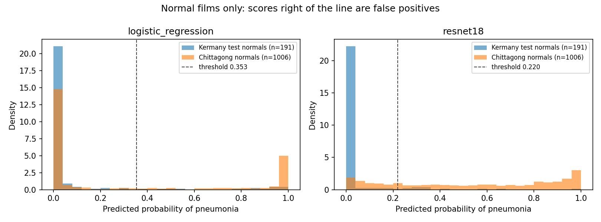

# Chest X-ray pneumonia classifier

**TL;DR:** I merged two public chest X-ray datasets and found that the second one is not independent. All 1,306 of its "pneumonia" images are exact copies of films in the first dataset, and 337 of them are copies of films labelled *normal* there. After removing every duplicate, a logistic regression and a fine-tuned ResNet-18 both reach a test ROC AUC of about 0.99 on the original (Kermany) data. On 1,006 genuinely new normal films from the second hospital, though, they call 33% and 74% of them pneumonia. High internal accuracy here does not carry over to another site. This is a research comparison, not a diagnostic device.



## Abstract

I built a chest X-ray working set from two CC BY 4.0 Mendeley datasets: the Kermany pediatric set from Guangzhou, and a 2026 set described as coming from Epic Hospital, Chittagong. A de-duplication step that matches files by hash and by thumbnail correlation found 1,576 clusters of copied films across the 8,482 downloaded images. Every Chittagong pneumonia image is a copy of a Kermany film, and in 337 clusters the copies carry opposite labels. After removing duplicates and every label-conflicting copy, I trained on 3,000 Kermany images and held out 1,006 unique Chittagong normal films as an external check. On the Kermany test set (451 images) the logistic regression on handcrafted features reached ROC AUC 0.986, and the fine-tuned ResNet-18 reached 0.989. A paired bootstrap interval for the 0.003 difference included zero. On the external normals, specificity at the validation-chosen threshold fell to 0.675 for the logistic regression and 0.261 for ResNet-18. The project is a reproducible pipeline covering data auditing, preprocessing (including a C++ step), a statistical check on the images, model comparison with confidence intervals, an external check, and Grad-CAM.

## Clinical background

Chest radiography is a common first test when pneumonia is suspected. Reading films is variable across clinicians and settings, so automated classification has been studied as a way to triage or to second-read images. Public pediatric collections, especially the Guangzhou chest X-ray set released by Kermany and colleagues, have produced very high published accuracies. Those numbers are easy to over-read: the images come from a narrow population, the original labels pool bacterial and viral pneumonia, and a random image split can put two films of the same child on both sides of the evaluation.

This repository asks two questions. First, when two public archives are merged, are they really two independent sources? Second, after the data are cleaned, how does a logistic regression on fixed features compare with a fine-tuned ResNet-18 on a patient-aware holdout, and how do both behave on normal films from a different hospital?

## Methods

### Data sources and licenses

Both archives are public Mendeley Data records. No new images were collected.

| Source | What was used | License | Citation |
| --- | --- | --- | --- |
| Kermany, Zhang, and Goldbaum, Mendeley Data V2, [doi:10.17632/rscbjbr9sj.2](https://doi.org/10.17632/rscbjbr9sj.2) | `ChestXRay2017.zip` only. The OCT archive in the same record was not downloaded. | CC BY 4.0 | Kermany D, Zhang K, Goldbaum M (2018). Labeled Optical Coherence Tomography (OCT) and Chest X-Ray Images for Classification. Mendeley Data, V2. |
| Hira and colleagues, Mendeley Data V4, [doi:10.17632/wndbd5r26y.4](https://doi.org/10.17632/wndbd5r26y.4) | The version-4 zip of chest radiographs described as coming from Epic Hospital, Chittagong. A later version 5 exists; version 4 is pinned so the file hash stays fixed. | CC BY 4.0 | Hira MDIK, Bithee MMA, Ahmed S, Akter L, Anonna MJM (2026). A Primary Chest X-ray Dataset of Normal and Pneumonia Cases from Epic Chittagong, Bangladesh. Mendeley Data, V4. |

The related clinical paper for the first archive is Kermany et al., *Cell* 2018;172(5):1122–1131. SHA-256 of the downloaded zips:

- `ChestXRay2017.zip` (1,235,512,464 bytes): `13efc055629733dbab07877f8b3c9f81097840dbcdaa326a8542322c2281ce36`
- `epic_chittagong_v4.zip` (524,752,385 bytes): `a4b400d3b04454976f67ab2686e60bd74e4149cd5e6cc05af7102c62cc0132b7`

Raw folder counts, before de-duplication (8,482 images):

| Source | Normal | Pneumonia |
| --- | ---: | ---: |
| Kermany | 1,583 | 4,273 |
| Chittagong | 1,320 | 1,306 |

The Chittagong text description says 3,355 images. The version-4 zip contains 2,626 image files. Counts here are from those files.

### De-duplication

`src/data/prepare.py` links two files as the same film when any of these hold:

1. identical SHA-256 of the file bytes;
2. identical 16×16 area-downsampled grayscale thumbnail;
3. Pearson correlation of their 32×32 grayscale thumbnails of at least 0.995 (`dedup_correlation` in `configs/default.yaml`).

Links are transitive, so copies form clusters. Correlation ignores the brightness and contrast changes that re-encoding introduces; an exact-thumbnail match does not. In every duplicate pair checked, the 16×16 thumbnails differed by exactly one grey level in a few pixels, which is why an exact match alone missed them. Some copies were also resized (512 vs. 1024 pixels).

Within a cluster, the Kermany copy is kept, then the earliest extracted path. If the copies in a cluster carry **different labels**, every copy is dropped, because nothing in the data says which label is right. Every cluster and the decision taken are listed in `reports/duplicate_clusters.csv`.

The 0.995 threshold sits in an empty gap. Every Chittagong image's best match in Kermany had a correlation either of at least 0.9999 (a copy) or below 0.95 (a different film), with nothing in between. Pairs just below 0.97 were inspected and are different children.

| | Count |
| --- | ---: |
| Duplicate clusters | 1,576 |
| Clusters whose copies disagree on the label | 337 |
| Images dropped as extra copies | 1,266 |
| Images dropped for a label conflict (all copies) | 723 |
| Images remaining | 6,493 |

Cluster types (`duplicate_cluster_types` in `reports/prepare_summary.json`):

| Members of the cluster | Clusters |
| --- | ---: |
| Chittagong pneumonia + Kermany pneumonia | 961 |
| Chittagong pneumonia + Kermany **normal** | 289 |
| Chittagong normal + Chittagong pneumonia + Kermany normal | 48 |
| Chittagong normal + Kermany normal | 157 |
| Chittagong normal only | 101 |
| Kermany pneumonia only | 17 |
| Kermany normal only | 3 |

What this means for the Chittagong archive:

- **Pneumonia (1,306 files):** every file is a copy of a Kermany film (correlation ≥ 0.9999). 969 copy a Kermany pneumonia film and 337 copy a Kermany *normal* film. No Chittagong pneumonia image is unique.
- **Normal (1,320 files):** 211 copy Kermany normal films; 1,109 have no match in Kermany. After within-archive duplicates and label conflicts are removed, 1,006 unique Chittagong normals remain.

So the archive does not add a second hospital's pneumonia cases, and its pneumonia class contains relabelled normal films. Any model trained on the merged set learns from contradictory labels, and any test split can contain copies of training images.

### Working set, external set, and splits

Train, validation, and test images come from Kermany only (`working_set_sources` in the config). With only Chittagong normals left, mixing them in would make "looks like Chittagong" a shortcut for "normal".

From the de-duplicated Kermany pool (1,242 normal, 4,245 pneumonia), the script draws 3,000 images with seed 42, as close to balanced as the 1.5 class-ratio limit allows: all 1,242 normal and 1,758 pneumonia films (ratio 1.42).

Splits are 70/15/15 by patient group, stratified by label, seed 42. Kermany pneumonia filenames contribute a `person` id, and normal filenames contribute an `IM-` id; files like `IM-0129` and `NORMAL2-IM-0129` share a group, which keeps them in one split. The 3,000 images form 2,021 groups. No group crosses splits.

| Split | Normal | Pneumonia | Images |
| --- | ---: | ---: | ---: |
| Train | 855 | 1,240 | 2,095 |
| Validation | 196 | 258 | 454 |
| Test | 191 | 260 | 451 |
| External (Chittagong) | 1,006 | 0 | 1,006 |

After sampling, no two of the 4,006 selected images correlate above 0.977. The manifest is `reports/manifest.csv`. The test and external sets are scored once, after thresholds are chosen on validation.

### Preprocessing

Every selected radiograph is converted to grayscale, resampled to 224×224 without preserving aspect ratio, denoised with a 3×3 median filter, and intensity-normalized by stretching the 1st–99th percentile window onto 0–255. The archives do not include landmarks for spatial registration.

The median filter is a separate C++ program, `cpp/median_denoise.cpp`, compiled with g++ and called through `subprocess` on binary PGM files. A NumPy implementation of the same replicate-border filter is the reference. On the 100-image benchmark the maximum absolute pixel difference was 0, and a unit test compiles the C++ and compares it again.

| Implementation | 100 images of 224×224 | Throughput |
| --- | ---: | ---: |
| C++ executable, including process start and PGM read/write | 0.257 s | 389 images/s |
| In-memory NumPy median | 0.244 s | 409 images/s |

The full 4,006-image denoise took 10.0 s in the C++ program (g++ 11.4, `-O2`, Linux aarch64). The two are about equally fast here: the NumPy version is vectorized and its timer excludes process startup and file I/O, while the C++ program is a simple scalar loop.

Training augmentation, applied only to the training split, is a horizontal flip (probability 0.5), a rotation of ±15 degrees, and a contrast scale drawn from 0.8–1.2. A horizontal flip moves the heart to the right side of the image, so flipped films are not anatomically realistic; see Limitations.

### Models

The baseline is a logistic regression (`C = 1`, `class_weight = balanced`, seed 42) on 1,863 standardized features: HOG on a 128×128 view, a 32-bin intensity histogram, mean, standard deviation, skewness, and an 8×8 average pool.

The convolutional model is an ImageNet ResNet-18 with a new two-class head, trained in PyTorch with class-weighted cross-entropy. The backbone learning rate is `1e-5` and the head learning rate is `1e-4` (AdamW, weight decay `1e-4`, batch size 16). The checkpoint is the epoch with the highest validation AUC, with patience 2 and a maximum of 6 epochs. Validation AUC rose every epoch to 0.9934 at epoch 5 and was 0.9933 at epoch 6, so epoch 5 was kept and early stopping did not trigger. Each epoch took about 315–326 s on 3 CPU threads.

### Evaluation

Pneumonia is the positive class. The reported operating point maximizes Youden's J on the validation probabilities and is then frozen for the test and external sets. ROC AUC does not use that threshold. A second table uses probability 0.5. Uncertainty on the AUC is a 2,000-draw percentile bootstrap, and the model difference uses a paired bootstrap on the same test images.

The external set contains only normal films, so it can measure specificity (the share of normal films correctly called normal) but not sensitivity. Its interval is a 95% Wilson interval.

Grad-CAM is taken from the last residual block of ResNet-18 and is drawn for the predicted class on the most confident true positive, true negative, false positive, and false negative in the test set.

## Results


The pneumonia proportion in the working set is 0.586 (95% Wilson interval 0.568–0.604). This ratio was set by the number of unique Kermany normal films (1,242), not by prevalence.

Mean pixel intensity after preprocessing is higher for pneumonia (152.8, SD 18.8) than for normal films (143.2, SD 12.6). The Welch difference (pneumonia minus normal) is 9.69 gray levels, 95% CI 8.57–10.81, t = 16.94 on 2,990 degrees of freedom, p = 1.6×10⁻⁶¹. A two-sided Mann–Whitney test gives p = 1.7×10⁻⁵⁴. These use the 3,000 working images, including the test split; nothing in the models or thresholds was chosen from them. The shift can come from disease, from acquisition, or from the percentile stretch. It is not by itself evidence of a clinical marker.


### Kermany test set (451 images)


| Model | AUC | 95% bootstrap CI |
| --- | ---: | --- |
| Logistic regression | 0.986 | 0.977–0.993 |
| ResNet-18 | 0.989 | 0.979–0.997 |

ResNet-18 minus logistic regression is +0.003, paired 95% bootstrap CI −0.004 to +0.010. The interval includes zero, so this test set does not separate the two models.

Operating point chosen on validation (Youden), then applied to the test set:

| Model | Threshold | Sensitivity | Specificity | Accuracy |
| --- | ---: | ---: | ---: | ---: |
| Logistic regression | 0.353 | 0.946 (246/260) | 0.921 (176/191) | 0.936 |
| ResNet-18 | 0.220 | 0.977 (254/260) | 0.932 (178/191) | 0.958 |

The same test probabilities at a fixed threshold of 0.5:

| Model | Sensitivity | Specificity | Accuracy |
| --- | ---: | ---: | ---: |
| Logistic regression | 0.938 (244/260) | 0.932 (178/191) | 0.936 |
| ResNet-18 | 0.954 (248/260) | 0.984 (188/191) | 0.967 |


### External check: 1,006 Chittagong normal films

| Model | Threshold | False positives | Specificity (95% Wilson CI) | Kermany test specificity |
| --- | ---: | ---: | --- | ---: |
| Logistic regression | 0.353 (validation) | 327 | 0.675 (0.645–0.703) | 0.921 |
| Logistic regression | 0.5 | 300 | 0.702 (0.673–0.729) | 0.932 |
| ResNet-18 | 0.220 (validation) | 743 | 0.261 (0.235–0.289) | 0.932 |
| ResNet-18 | 0.5 | 542 | 0.461 (0.431–0.492) | 0.984 |

Both models lose most of their specificity on normal films from the other archive, and the CNN loses more. The figure at the top of this page shows why: Kermany test normals score close to 0, while the Chittagong normals are spread across the whole range, with many near 1. The Kermany films are pediatric, while many of the Chittagong normals look like adult films. The likeliest explanation is that both models learned what a normal *child's* chest looks like in this one archive. The CNN has the capacity to fit that more tightly.

### Grad-CAM


On the true positive, the map covers both lung fields. On the true negative it sits over the mediastinum and upper chest. On the false positive it concentrates on the lateral lung field on the left of the image. On the false negative it sits over the mediastinum rather than the lungs. Grad-CAM here is a sanity check, not a radiology report.

## Changes from the first version

An earlier version of this repository merged both archives with an exact 16×16 thumbnail match only, sampled 750 images per source and class, and reported test AUCs of 0.908 (logistic regression) and 0.924 (ResNet-18). An audit of that working set found 292 surviving duplicate pairs, 117 of them with opposite labels, and 85 test images that had a copy in the training or validation split. The tolerant de-duplication above replaced it, and every number in this README comes from the rerun. The earlier numbers should not be cited.

## Limitations and ethics

This model must not be used to diagnose, rule out, or triage patients. It has not been tested prospectively, it is not calibrated for a real clinic's prevalence, and the external check shows it does not transfer to a second archive.

The training and test data are a single pediatric archive from Guangzhou. The test AUC therefore measures performance on more films like the training films. The external set is normal films only, so it says nothing about sensitivity at another site, and its labels have not been verified; given the relabelling found in the same archive, some "normal" films may be mislabelled. Bacterial and viral pneumonia are one positive label, so the model is not a pathogen classifier.

The label-conflict rule removes every copy, including 338 Kermany normal films whose copies were labelled pneumonia in Chittagong. Trusting the Kermany label instead would keep more normal films; the stricter rule was chosen because Kermany labels are not radiologist re-reads either.

De-duplication catches files whose 32×32 thumbnails correlate at 0.995 or above. Heavily cropped, rotated, or edited copies would correlate lower and could survive. No such pairs were seen in the gap between 0.95 and 0.9999, but they cannot be ruled out.

Patient grouping relies on Kermany filenames. If one child's films were filed under different ids, they could fall into different splits and make the test AUC optimistic.

Horizontal-flip augmentation produces mirror-image chests (heart on the right). It was kept as a generic regularizer, but it is not anatomically realistic and a version without it has not been compared.

No radiologist re-read these labels for this project. Label noise, markers burned into the film, and pediatric body shape can all be shortcuts, and the external result suggests that at least one shortcut is being used. There is no fairness audit by age, sex, scanner, or hospital, because those fields are not in the archives.

The intensity difference between classes should not be quoted as a biological result without a pre-registered acquisition protocol. Percentile normalization can itself change the mean.

Both datasets are CC BY 4.0. Derived figures in this repository keep that attribution. The images remain someone else's clinical data even though they are public: they are not a reason to collect new identifiable films, and they are not a product.

## Reproducing the project

Verified with Python 3.10.12 on Linux aarch64, using the exact package versions in `requirements.txt` (PyTorch 2.10.0 CPU, OpenCV 4.10, scikit-learn 1.7.2). OpenCV 5 does not provide the HOG descriptor the baseline needs, so keep the pinned 4.10. g++ with C++17 is required; `src/preprocessing/preprocess.py` compiles `cpp/median_denoise.cpp` if the binary is missing or will not run on the current machine. A CUDA build of PyTorch works with the same scripts; this recorded run used the CPU.

From the repository root:

```bash
pip install -r requirements.txt
python -m src.data.download
python -m src.data.prepare
python -m src.preprocessing.preprocess
python -m src.eda.explore
python -m src.models.baseline
python -m src.models.train_cnn
python -m src.evaluation.evaluate
```

`python scripts/run_pipeline.py` runs those steps in order (`--from <step>` resumes, `--skip-download` skips the download). The random seed is 42 in `configs/default.yaml`. Download needs network access to Mendeley Data and about 2 GB for the two zips; training downloads the ImageNet ResNet-18 weights (`resnet18-f37072fd.pth`, 45 MB) into `.cache/torch` on first use. Expect roughly five minutes per ResNet epoch on a laptop CPU. In the recorded run, CNN training was executed in time-limited chunks that saved and restored the full training state (weights, optimizer, random-number streams, and position in the epoch); the loop, seed, and settings are those of `train_cnn.py`. CPU results can differ slightly between machines and library versions.

Unit checks that do not need the radiographs (39 tests):

```bash
python -m unittest tests.test_sample tests.test_preprocess tests.test_metrics
```

## Repository layout

```text
configs/default.yaml          seed, sample size, de-dup threshold, sources, training settings
src/data/                     download, de-duplication, sampling, patient-grouped splits
src/preprocessing/            resize, percentile normalization, C++ launch
cpp/median_denoise.cpp        3x3 median filter
src/eda/explore.py            class counts, Wilson interval, Welch test
src/models/                   logistic regression and ResNet-18
src/evaluation/               ROC, confusion matrices, external check, Grad-CAM
scripts/run_pipeline.py       runs every step in order
tests/                        sampling and de-dup, PGM and C++ filter, metric helpers
reports/                      manifest, duplicate clusters, predictions, metrics, figures
```

Raw zips, images, and model weights are gitignored. `reports/manifest.csv`, `reports/duplicate_clusters.csv`, and `reports/metrics.json` record the sample, the de-duplication decisions, and the numbers in this file.

## License

Code: MIT (see `LICENSE`). Data and derived figures: CC BY 4.0, attributed to the dataset authors above.

## Author

Susan Lu Tsz Ching, BEng Biomedical Engineering, King's College London. GitHub: [@llx010305](https://github.com/llx010305)
